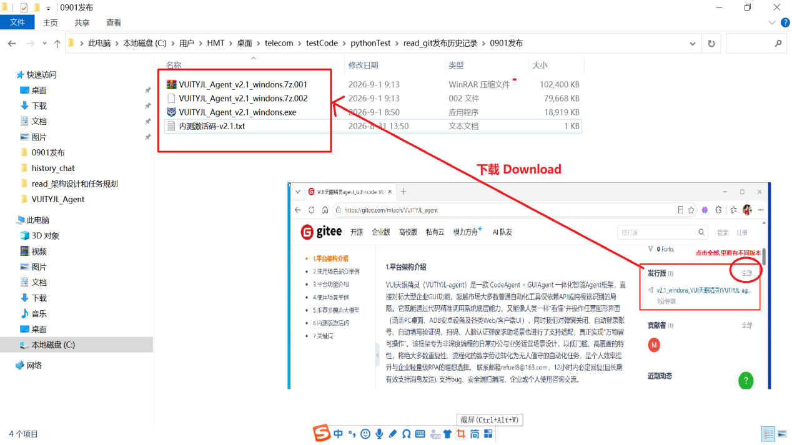
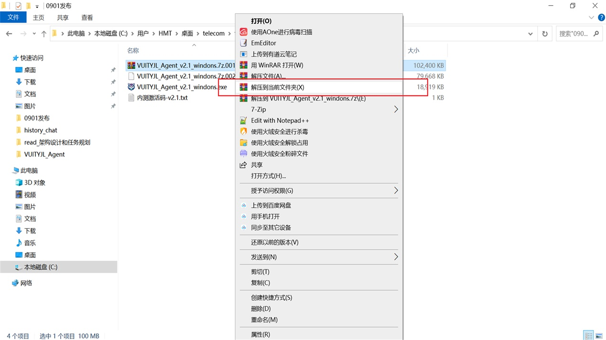
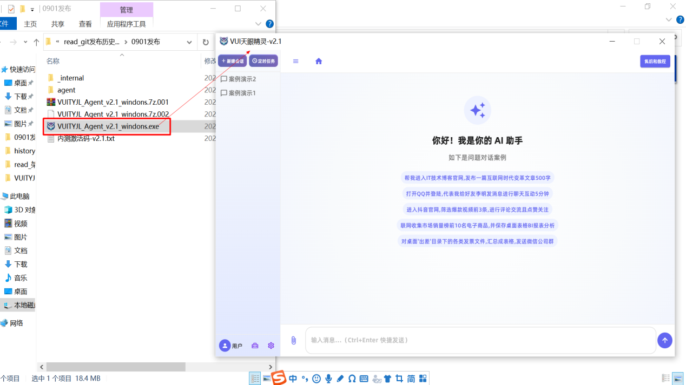
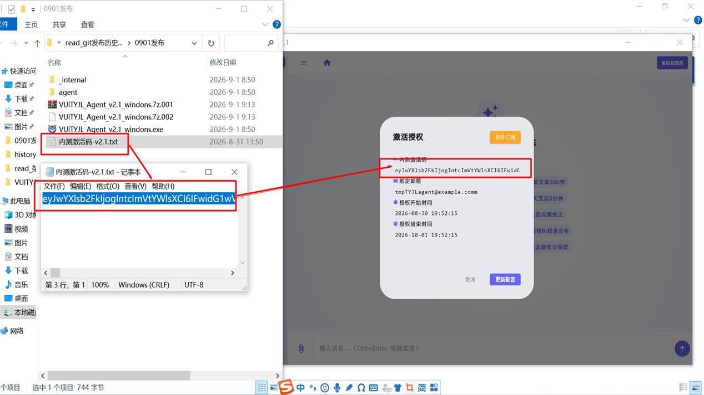
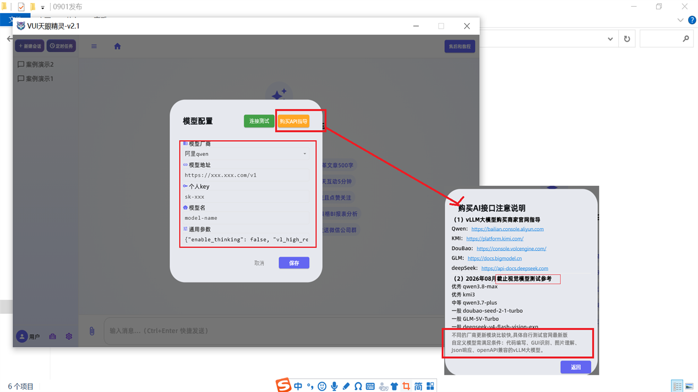

#### 1. Platform Architecture Overview
VUI SkyEye Agent (VUTIYJL-agent) is an integrated intelligent agent framework combining CodeAgent and GUIAgent capabilities. It delivers enterprise-grade GUI automation functionality with significant advantages in coverage and interaction methods. The framework can both invoke system-level capabilities precisely through code and simulate human-like visual perception and interaction with various graphical interfaces (including PC desktops, ADB-connected Android devices, and Web/client-side UIs). It also provides adaption support for common scenarios such as pop-up window handling and account verification, enabling broad interface operation capabilities. Designed for non-deep-programming daily office and business operations scenarios, the framework transforms the majority of repetitive, process-oriented digital tasks into unattended automation workflows. It serves as an ideal choice for personal productivity enhancement and lightweight enterprise RPA solutions. Contact: refuel8@163.com — responses within 12 hours (long-term effective for message exchange). We welcome bug reports, security suggestions, and usage consultations.

#### 2. Use Case Examples by Industry
| No. | Industry | Example Scenarios |
| :---: | :--- | :--- |
| 1 | Short Video / Live Streaming | Monitor comment sections for keywords and generate leads |
| 2 | Private Domain Sales | Follow up with customers and maintain relationships via social chats |
| 3 | Cross-Border E-Commerce | Batch list products and sync inventory across multiple platforms |
| 4 | Finance & Taxation | Automatically capture invoices across systems and complete reimbursement forms |
| 5 | Human Resources | Auto-filter resumes and send interview invitations across job platforms |
| 6 | Government Administration | Automate internal approval workflows and document sealing/archiving |
| 7 | Healthcare | Auto-enter patient information into HIS systems and generate reports |
| 8 | Education & Training | Auto-check-in for online courses and track learning progress |
| 9 | Legal Services | Automatically retrieve and summarize similar cases from legal databases |
| 10 | Property Management | Auto-assign repair tickets and conduct satisfaction surveys |
| 11 | Food & Retail | Auto-reply to negative reviews and distribute coupons on delivery platforms |
| 12 | IT Operations | Schedule regular inspections and alert notifications for legacy internal systems |
| 13 | Others | ...and more scenarios |

Note: This framework is primarily designed for daily office and business operations scenarios. For intermediate-to-advanced development or software programming use cases, we recommend using specialized development tools in conjunction with this framework.

#### 3. Platform Features
The software offers a simple, intuitive UI focused on core functionality and results-driven outcomes.

 **Feature 1: Task Session** 

 **Feature 2: Scheduled Tasks** 

 **Feature 3: Custom Skills** 

 **Feature 4: Mobile App Remote Control** 
Available for enterprise edition only...

#### 4. Use Case Demonstrations
The following cases are functional demonstrations intended to showcase the framework's capabilities. In actual usage, users should ensure compliance with the terms of service and applicable laws/regulations of the relevant platforms.

 **Case 1 – Public Traffic Engagement** : Open a short-video website, search for videos with specified keywords, navigate to the comment section, extract several user comments, and auto-generate friendly replies to complete basic interactions. After completion, aggregate the usernames of interacted users and send them to a designated enterprise IM group (e.g., DingTalk or Feishu). (Partial screenshots shown below)

 
**Case 2 – Collaborative File Sharing** : Read a data spreadsheet from a specified local folder, open a commonly used instant messaging application (e.g., WeChat or WeCom), send the file to a designated work group, and attach a text message based on the file content (e.g., recognizing outstanding employees). Introduce a delayed wait; if new messages appear in the group, auto-respond based on the message content. (Partial screenshots shown below)

 **Case 3 – Server Ops Notification** : Automatically open the local terminal/Shell tool, connect to a specified server, query disk and memory usage, capture the results, and send the screenshot to a designated email address (e.g., demo_test@example.com). (Partial screenshots shown below)

 **Case 4 – Mobile Automation** : Through an ADB-connected screen projection, operate the phone to open a mainstream short-video application, complete the login process (phone verification code entry requires human assistance upon request), and publish a post with text and images after successful login. (Partial screenshots shown below)

 **Case 5 – Social Interaction & Relationship Maintenance** : Open the PC version of an instant messaging application, navigate to friends' feeds, like and comment on multiple posts. Then switch to the chat list, identify contacts with no recent interaction, and automatically send greeting messages to them. (Partial screenshots shown below)

#### 5. Recommended Multimodal Models
We recommend using mainstream high-performance multimodal large language models (e.g., vLLM-based models). Different vendors have varying update cycles; please test and refer to official announcements for the latest version information.

Custom models should meet the following criteria: code generation, GUI recognition, image understanding, JSON response handling, and openAPI compatibility. Model performance directly impacts automation effectiveness; higher-performance versions are strongly recommended.

#### 6. Keywords
GUI+Code Automation, RPA Robotic Process Automation, CodeAgent, GUIAgent, Visual Recognition Automation, Desktop Automation, Android ADB Automation, Web UI Automation, Pop-up Auto-Handling, Auto-Login & CAPTCHA Handling, Unattended Task Automation, Low-Code RPA
GUI and Code automation, RPA robotic process automation, CodeAgent intelligent agent, GUIAgent visual agent, visual recognition automation, desktop automation, Android ADB automation, Web UI automation, pop-up auto-handler, auto-login and captcha solver, unattended task automation, low-code RPA

#### 7. Download & Installation 
 **[1] Download the Installation Package** 

 **[2] Extract the Installation Package** 

 **[3] Double-click to Launch** 

 **[4] Enter the Internal Testing Activation Code** 

 **[5] Configure the LLM Interface** 

Note: GUI scenarios require high-performance models. We recommend using high-performance models such as km3, qwen3.8, or above for optimal results. :exclamation:  :exclamation: 

 **[6] Ready to Chat!!!**
